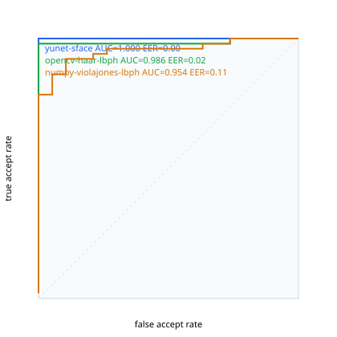

# Face-engine benchmark

_Pair source: **bundled tests/fixtures micro-set (augmented)**_

| engine | genuine | impostor | mean gen | mean imp | margin | AUC | EER | TAR@FAR=1e-2 | acc@thr | thr |
|---|--:|--:|--:|--:|--:|--:|--:|--:|--:|--:|
| `yunet-sface` | 51 | 19 | 0.951 | 0.114 | **0.837** | **1.000** | 0.000 | 1.000 | 1.000 | 0.40 |
| `opencv-haar-lbph` | 51 | 19 | 0.945 | 0.757 | **0.188** | **0.986** | 0.020 | 0.980 | 0.971 | 0.86 |
| `numpy-violajones-lbph` | 51 | 19 | 0.893 | 0.740 | **0.153** | **0.954** | 0.105 | 0.784 | 0.743 | 0.86 |

## Robustness (genuine Obama pair, one side perturbed)

### `yunet-sface` (threshold 0.40)

| perturbation | cosine | still matches |
|---|--:|:--:|
| (none) | 0.980 | yes |
| jpeg_q30 | 0.972 | yes |
| resize_0.5x | 0.955 | yes |
| rotate_+8 | 0.969 | yes |
| rotate_-8 | 0.963 | yes |
| greyscale | 0.949 | yes |
| gamma_1.6 | 0.977 | yes |
| crop_pad | 0.951 | yes |

### `opencv-haar-lbph` (threshold 0.86)

| perturbation | cosine | still matches |
|---|--:|:--:|
| (none) | 0.950 | yes |
| jpeg_q30 | 0.950 | yes |
| resize_0.5x | 0.943 | yes |
| rotate_+8 | 0.880 | yes |
| rotate_-8 | 0.943 | yes |
| greyscale | 0.950 | yes |
| gamma_1.6 | 0.950 | yes |
| crop_pad | 0.928 | yes |

### `numpy-violajones-lbph` (threshold 0.86)

| perturbation | cosine | still matches |
|---|--:|:--:|
| (none) | 0.853 | NO |
| jpeg_q30 | 0.840 | NO |
| resize_0.5x | 0.914 | yes |
| rotate_+8 | 0.855 | NO |
| rotate_-8 | 0.881 | yes |
| greyscale | 0.855 | NO |
| gamma_1.6 | 0.932 | yes |
| crop_pad | 0.846 | NO |
